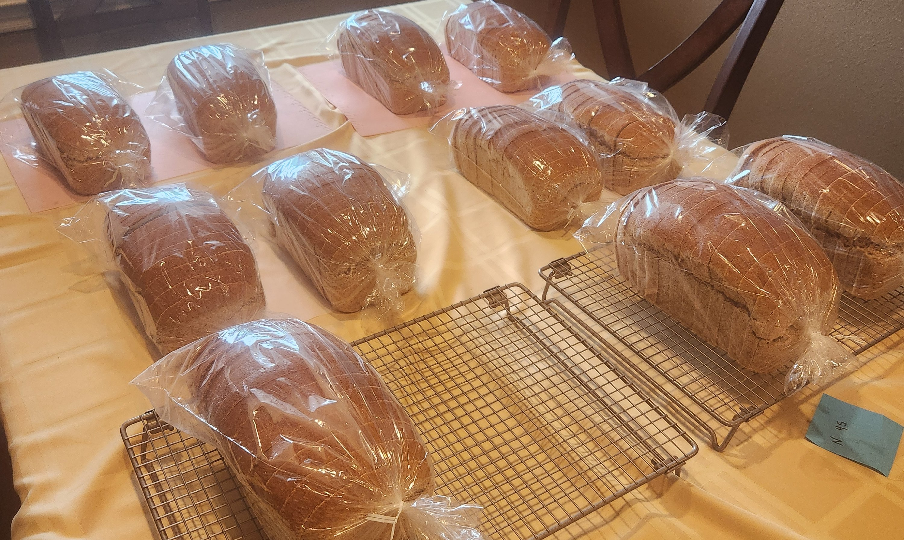
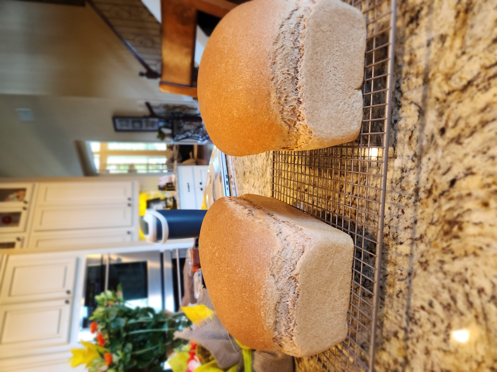

# The Quest for Fluffy Whole Wheat
This project began as a household quest. After my wife and I decided to stop buying standard white bread, I found myself disappointed with the dense, lackluster whole wheat loaves available at the grocery store. I made it my mission to engineer the best, most fluffy whole wheat sandwich bread imaginable. This journey led me through countless techniques, explorations of different flour and wheat varieties, and a deep dive into the science of bread-making.

During my research, I frequently came across a claim that a tablespoon of lemon juice added to the dough would optimize the pH level and lead to optimal yeast activity. I was immediately sceptical, but as a good statistician, I knew that a claim, no matter how dubious, was ultimately a testable hypothesis.

## The Experiment Design
I decided to design an experiment to formally test this "lemon juice theory."

### Factors and Treatments
The experiment had two main factors:
1. Lemon Juice: (Present vs. Absent)
2. Rise Time: (45 minutes vs. 60 minutes). I included this second factor because if the lemon juice did increase yeast activity, it might affect the optimal proofing time.

These two factors led to four unique treatment combinations (45min/Lemon, 45min/No Lemon, 60min/Lemon, and 60min/No Lemon)

### Blocking and Randomization
To manage the baking process, I used a randomized block design. I conducted the experiment in three "batches," where each batch represented a single block. Within each batch, all four treatment combinations were prepared, risen, and baked at the same time (though in different mixers). This block structure helps account for any environmental variability between baking sessions.

For each batch, the four treatments were randomly assigned to one of four mixer-baker pairs.

### Procedure and Controls
To ensure consistency, a single loaf's worth of dough was prepared for each experimental unit. All ingredients were meticulously pre-measured, and the flour was weighed to guarantee each loaf received the exact same mass of flour and the temperature of the water was measured for each loaf to ensure that it was about 107 F. The only intended difference was the presence or absence of lemon juice.

While all four mixers used were Bosch Universal Plus models, two were of an older design. I noted this difference but proceeded under the assumption that any variance due to the specific mixer model would be negligible compared to the treatment effects.

### Response Variable
Our chosen proxy for "fluffiness" was the final bread perimeter. We measured this by taking a flexible measuring tape and recording the perimeter (in centimeters) around the center of the baked loaf. To reduce variability in loaf shape, we also standardized the process by gently flattening the dough in the loaf pan immediately after shaping and before proofing.

I recipe that I used for this experiment is found [here](https://anoregoncottage.com/whole-wheat-sandwich-bread-101/). The only modifications that I made were halving all of the ingredients to produce a single loaf (rather than two).
